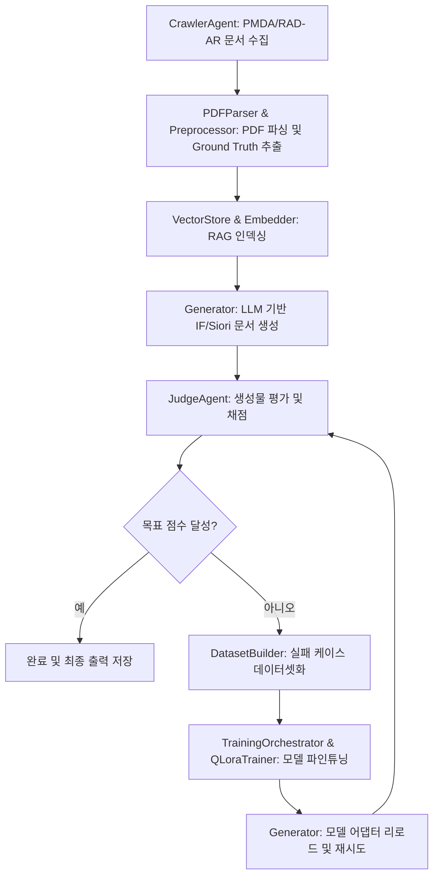

# CTD2Doc 사용 설명서 (Manual)

`CTD2Doc`은 비교 독성유전체학 데이터베이스(CTD) 및 PMDA(의약품의료기기종합기구)의 자료를 활용하여 의약품에 대한 인터뷰 폼(IF, Interview Form) 및 환자용 서면 안내서(Siori, 薬のしおり)를 자동으로 생성, 평가 및 모델 학습을 수행하는 폐루프(Closed-loop) 자동화 파이프라인 시스템입니다.

---

## 1. 시스템 아키텍처 개요

본 프로젝트는 아래의 핵심 프로세스로 동작합니다.



---

## 2. 사전 준비 및 환경 설정

### 2.1 패키지 설치
이 프로젝트는 가상환경 관리 및 의존성 설치에 `uv` 사용을 권장합니다.

```bash
# 가상환경 생성 및 활성화
uv venv
.venv\Scripts\activate

# 필요한 패키지 설치 (pyproject.toml 기반)
uv pip install -e .
```

### 2.2 설정 파일 구성
모든 설정은 `config/` 디렉토리 아래의 두 YAML 파일로 제어합니다.

#### 1) 전역 설정 (`config/settings.yaml`)
모델 설정, 경로 및 파인튜닝 파라미터를 정의합니다.
* **`pipeline`**: 목표 점수(`target_score`) 및 최대 파인튜닝 시도 횟수(`max_iterations`)를 지정합니다.
* **`model`**: 추론/평가에 사용할 베이스 모델(`google/gemma-2-27b-it`) 및 임베딩 모델을 지정합니다.
* **`paths`**: 데이터 수집, 파싱, 인덱싱, 저장 경로를 지정합니다.
* **`training`**: QLoRA 파인튜닝 하이퍼파라미터(Learning Rate, Epoch, Batch Size 등)를 조절합니다.

#### 2) 의약품 목록 설정 (`config/drug_list.yaml`)
자동 생성 및 평가를 진행할 대상 의약품을 지정합니다.
* **`crawler.mode`**: `"static"` (지정 리스트만), `"auto"` (PMDA 카테고리 자동 수집), `"both"` (둘 다 실행) 중 선택합니다.
* **`static_list`**: 수집 대상 의약품의 `japic_code`, 일어 이름(`name_ja`), PMDA URL, RAD-AR URL 정보를 입력합니다.

---

## 3. 핵심 구성 모듈 및 기능

### 3.1 수집 & 전처리 (Ingestion)
* **`CrawlerAgent`** (`src/ingestion/crawler.py`): PMDA와 RAD-AR 웹사이트를 크롤링하여 CTD PDF, IF PDF, Siori HTML을 자동으로 매칭하여 로컬 시스템(`data/raw`)에 다운로드합니다. 일본어 인코딩(Shift-JIS 등)을 자동 감지해 텍스트 처리를 수행합니다.
* **`PDFParser`** (`src/ingestion/pdf_parser.py`): 다운로드한 CTD PDF 문서를 구조화된 마크다운 포맷으로 변환합니다.
* **`Preprocessor`** (`src/ingestion/preprocessor.py`): 수집된 데이터셋으로부터 Ground Truth 데이터를 가공하여 추출합니다.

### 3.2 검색 증강 생성 (RAG)
* **`Embedder`** (`src/rag/embedder.py`): 다국어 임베딩 모델을 활용하여 텍스트를 임베딩 벡터로 변환합니다.
* **`VectorStore`** (`src/rag/vectorstore.py`): 가공된 텍스트와 메타데이터를 벡터 DB에 인덱싱합니다.
* **`Retriever`** (`src/rag/retriever.py`): 질의와 매칭되는 최적의 참조 청크를 검색하여 Generator에 컨텍스트로 제공합니다.

### 3.3 문서 생성 (Inference)
* **`Generator`** (`src/inference/generator.py`): RAG 검색 결과를 활용하여 타겟 의약품의 인터뷰 폼(IF)과 환자용 설명서(Siori)를 생성합니다. 파인튜닝을 거친 후에는 새로운 LoRA 어댑터 가중치를 실시간으로 리로드(`reload_adapter`)하여 출력을 개선합니다.

### 3.4 자동 평가 (Evaluation)
* **`JudgeAgent`** (`src/evaluation/judge_agent.py`): LLM을 판정관(Judge)으로 삼아 생성된 문서와 Ground Truth 문서를 비교 분석하고 점수 보고서를 발행합니다.
* **`ScoringSystem`** (`src/evaluation/scoring.py`): 에이전트의 채점 점수 변화 추이를 누적 기록합니다.

### 3.5 데이터셋 생성 & 파인튜닝 (Training)
* **`DatasetBuilder`** (`src/training/dataset_builder.py`): 평가 점수가 통과하지 못했을 때(목표치 미만), 실패한 예시를 정제하여 SFT(지도 미세 조정) 학습용 JSON 데이터셋을 자동으로 누적 업데이트합니다.
* **`QLoraTrainer`** (`src/training/trainer.py`): 메모리 효율을 극대화한 QLoRA 기법을 통해 로컬/GPU 환경에서 파인튜닝을 실행합니다.
* **`TrainingOrchestrator`** (`src/training/orchestrator.py`): 점수 분석을 바탕으로 학습을 트리거하고 가중치 체크포인트를 관리합니다.

---

## 4. 파이프라인 실행 및 사용법

파이프라인을 실행하여 전체 의약품 목록에 대해 자동으로 **수집 ➡️ RAG ➡️ 생성 ➡️ 평가 ➡️ (성능 부족시) 학습** 흐름을 반복 구동할 수 있습니다.

### 4.1 통합 파이프라인 실행 코드 예시
`main.py` 파일 또는 별도 스크립트에서 다음과 같이 실행할 수 있습니다.

```python
from src.pipeline import AutonomousPipeline

def run_ctd2doc_pipeline():
    # settings.yaml 로드 및 파이프라인 초기화
    pipeline = AutonomousPipeline(config_path="config/settings.yaml")
    
    # 설정된 모든 의약품 루프 실행
    print("Starting Autonomous CTD2Doc Pipeline...")
    pipeline.run_all()
    print("Pipeline completed!")

if __name__ == "__main__":
    run_ctd2doc_pipeline()
```

### 4.2 실행 출력 결과 확인
* **생성된 문서**: `outputs/generated/JapicCode_{JapicCode}/` 디렉토리 아래에 `generated_if.md` 및 `generated_siori.md` 파일로 저장됩니다.
* **평가 및 학습 히스토리**: `outputs/reports/` 및 `outputs/checkpoints/`를 통해 채점 기록과 미세 조정된 LoRA 가속 어댑터를 확인할 수 있습니다.
